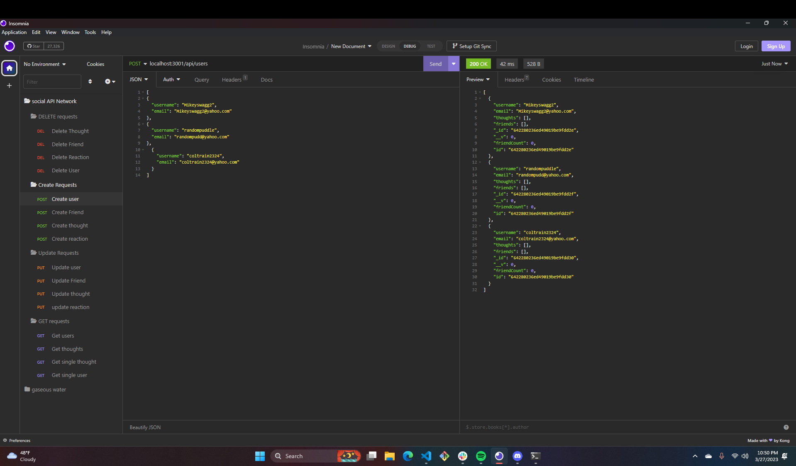
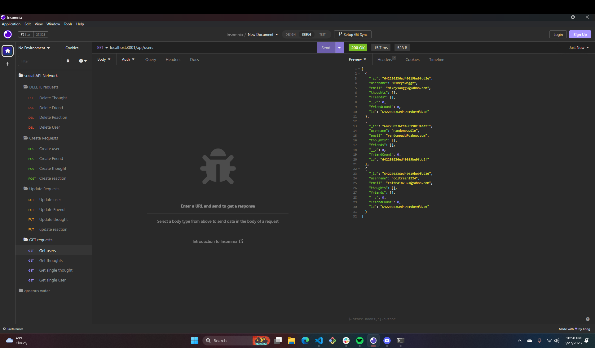
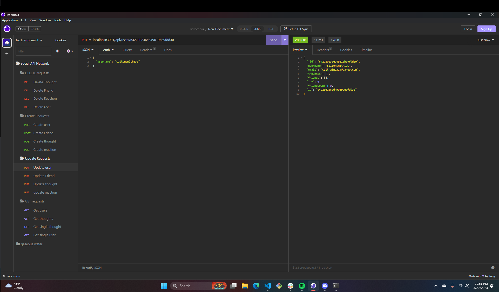
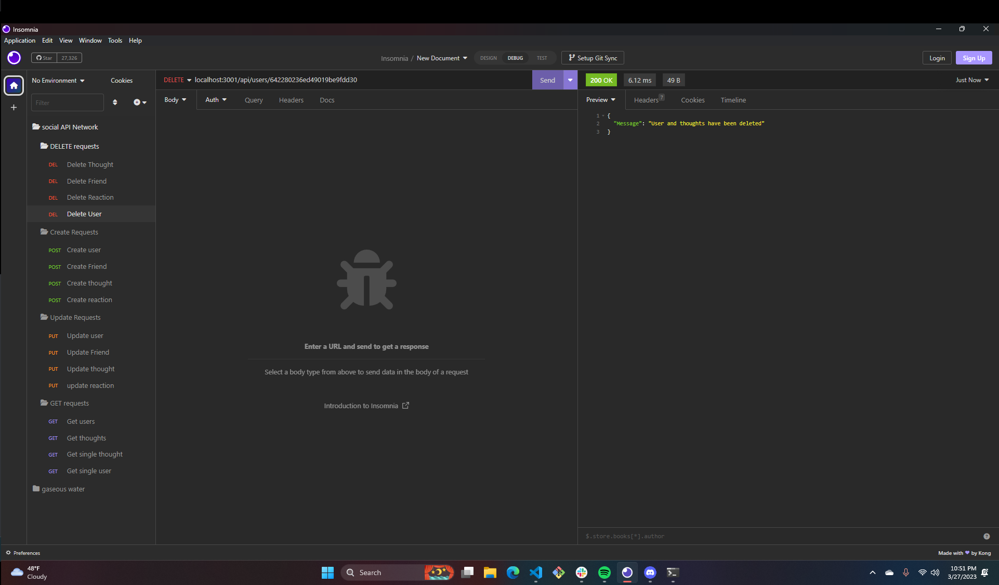

# socialNetworkApi
https://github.com/coltonsmith135/socialNetworkApi

# Description
This project is about creating users, friends, thoughts and reactions using mongoosedb on the back end of an application
# Table of Contents:
* [Installation](#installation)
* [Usage](#usage)

 * [License](#License)

* [Credits](#credits)
* [Tests](#tests)

## installation

express, node, mongoose, nodemon, validator, insomnia

## contact info

coltonsmith135@yahoo.com

503 432 0228

## usage

the application is used by running it through mongoose db to create a database on the back end to create your user and thoughts

## License

  MIT

## credits

colton smith

## tests

using insomnia to test the routes

